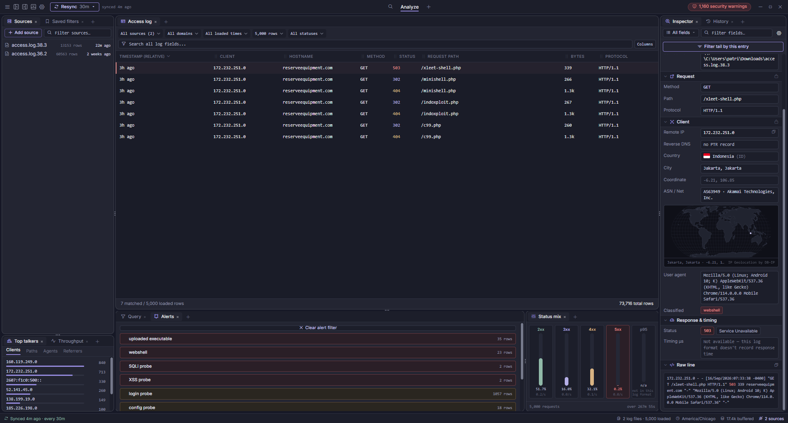

# Tomahawk (Apache Log Monitor)
<p align="center">
  
</p>

A desktop log-monitoring dashboard built on **Tauri 2 + Vue 3**. It tails
Apache-style access logs, stores the parsed rows in per-source SQLite
databases, and gives you a docked dashboard to filter, inspect, alert on,
and drill into that traffic.

The frontend is plain JavaScript/Vue (no TypeScript — see note below); the
native shell in `src-tauri/` is Rust and does all the real work: file
ingestion, SQLite storage, source management, geo-IP enrichment, and the
Tauri command surface the UI calls.

## Features

- **Tails real access logs** — register a file or a directory of files
  (with glob matching, subfolder recursion, and per-file ingestion cursors).
  The UI is driven by a pull-on-demand *resync* model: new bytes are picked
  up on a timer (manual "Resync now", or every 30m/1h/6h/12h), not a
  continuous stream.
- **Docked, resizable layout** — left/bottom/right docks with splitters,
  a stream (Access log + Query), a bottom dock (Query builder / Alerts),
  and a status-mix column. Panels can be shown/hidden from the header toggles
  or the panel-picker popover, and the whole layout is persisted.
- **Access-log table** — sortable, draggable columns, per-column visibility,
  live search across every field, status-color coding, and an entry
  inspector with history.
- **Query builder** — visual field/operator conditions over the loaded rows,
  saved filters, and a global search palette (Ctrl/Cmd-K-style popover).
- **Alerts / security classification** — tags requests that *look* like
  probes or attacks (path traversal, SQLi/XSS/command-injection payloads,
  webshells, uploaded executables, file inclusion, template injection, SSRF,
  obfuscated payloads, config/login/debug probes, scanner UAs). Built-in
  rules can be toggled individually, and arbitrary custom regex rules
  (scope of URL / user-agent / IP / method / status / raw line + severity)
  can be added. Alert rows open a filtered view of the matching requests.
- **Workspaces** — tabbed workspaces (created, renamed by double-clicking,
  removed from the × button), each with its own persisted panel layout.
- **Geo enrichment** — optional DB-IP City/ASN database (downloaded in-app)
  backs country/ASN lookups, reverse DNS, and network-detail lookups shown
  in the inspector and top-talkers views.
- **Default is real data, with a browser fallback** — inside Tauri the app
  talks to the Rust backend; in a plain browser (`npm run dev`) it falls
  back to a mock row generator so the UI is usable without the native shell
  installed.

## Running it

```sh
npm install
npm run dev            # frontend only — plain browser dev server (mock data)
npm run tauri dev      # the real desktop app (needs the Rust toolchain)
npm run build          # frontend production build -> dist/
npm run tauri build    # bundled desktop app
node --test src/data   # run the frontend unit tests (node:test)
```

## Project structure

```
index.html                Vite entry point (title, Phosphor icons, Inter font)
src/
  main.ts                 mounts the app — plain JS content under a .ts name,
                           kept for consistency with the scaffold's entry point
  App.vue                 top-level shell: TopBar + current page + StatusBar +
                           global overlay components
  styles/
    tokens.css              the design system (colors, type, spacing)
    app.css                 shared page chrome (docks, tables, dialogs, popovers)
  store/
    monitor.js              Pinia store — all shared state: rows, filters, panels,
                            workspaces, sources, dialogs, alert rules, settings
  data/
    mock.js                 seed/panel-catalog data + the mock row generator
    logSource.js            *the seam* — pick the Tauri backend or the mock
                            generator; the store never knows which is running
    sourcesApi.js           Tauri commands for source management + dir browsing
    geoipApi.js             Tauri commands for geo-IP / DNS enrichment
    classification.js       the alert/classification rules (built-in + custom)
    classification.test.js, localPath.test.js, localPath.js
    format.js               colors + formatting helpers for the panels
  composables/
    useSparkline.js, useRelativeTime.js, useClickOutside.js
  components/
    TopBar.vue, StatusBar.vue     chrome (custom titlebar, window controls)
    MonitorPage.vue, Dock.vue, DockTabHeader.vue, Splitter.vue
    AccessLogPanel.vue            the main access-log table
    QueryPanel.vue, SavedFiltersPanel.vue, GlobalSearchPalette.vue
    AlertsPanel.vue, EntryInspectorPanel.vue, HistoryPanel.vue
    SourcesTreePanel.vue, ThroughputContent.vue, TopTalkersContent.vue,
    StatusMixContent.vue, WorldMap.vue
    AddSourceDialog.vue, SettingsDialog.vue, ConfirmDialog.vue, PromptDialog.vue,
    FileMenuDropdown.vue, PanelPickerPopover.vue, AppSelect.vue
    HostsPage.vue, ReportsPage.vue, AlertsPage.vue   (mock-driven dashboards)
    ExplorePage.vue           (placeholder — not designed yet)
src-tauri/               the Rust/Tauri native shell
  src/
    commands.rs             all #[tauri::command] handlers (sources, rows, geoip)
    ingest.rs               Apache-log parsing + tailing/cursor bookkeeping
    db.rs                   per-source SQLite schema + access
    config.rs               per-user config + source DB paths
    fsbrowse.rs             local directory listing for the add-source dialog
    geoip.rs                DB-IP database download + lookup
    enrichment.rs           reverse DNS + network-detail lookups
    parse.rs, types.rs, lib.rs, main.rs
```

## How rows get from a log file to the table

1. **Add a source** (`add_source`) — a path to a file or a directory,
   plus a glob pattern (`access.log*` by default) and optional subfolder
   recursion. Adding it validates the path and creates its SQLite schema
   immediately.
2. **Resync** (`pull_new_rows`) — tails each registered source's matching
   files from where its cursor last stopped, parses the new bytes
   (Apache combined, combined+vhost, combined+forwarded, or combined+duration),
   and inserts them into that source's database (`access_rows` table; the
   `cursors` table tracks how far each file has been read, so a full read of
   a file is never repeated).
3. **Hydrate on launch** (`load_recent_rows`) — the frontend has no memory
   between runs, but file cursors are already at EOF, so this loads a window
   of the newest rows straight from the databases to populate the table
   before the resync loop resumes.
4. **Render** — the store holds a capped in-memory `tailRows` window
   (default ~400) that every panel (table, query builder, alerts, talkers,
   throughput, status mix) filters and derives from.

## Alerts & classification

`src/data/classification.js` ships a set of built-in regex classifiers at
`high` (exploit-shaped tags) and `warn` (probing/scanning tags) severity.
They run over the request path + query (both raw and URL-decoded) and
optionally the user agent. Rule sets and behavior are configurable in
**Settings → Alerts**:

- toggle all built-ins on/off, or a specific one;
- bot-detection on/off;
- add custom regular-expression rules with a scope
  (`url`, `ua`, `ip`, `method`, `status`, `raw`) and severity.

The top bar shows a live count of classified rows in the loaded window and
opens the Alerts panel, which aggregates by rule; clicking an alert pivots
the table to the matching rows.

## Data locations (per-user)

Rust resolves a platform `ProjectDirs` for `com.vsteks.tomahawk`:

- **config** — the registered sources config (`config.toml`)
- **data/sources** — one SQLite file per source (`<sourceId>.db`); removing
  a source deletes it
- optional DB-IP geo database is also stored under the data dir

## Plain JS, not TypeScript

`create-tauri-app` scaffolded a Vue+TypeScript project (`tsconfig.json`,
`vue-tsc`) but the frontend is written as plain JS/Vue and `src/main.ts` is
JS-compatible content under a `.ts` name. Every other file is `.js`/`.vue`
with no `lang="ts"`. The `build` script is plain `vite build`
(not `vue-tsc --noEmit && vite build`) — `typescript`/`vue-tsc` remain as
devDependencies if you ever want to convert files and re-enable the check.

## Notes / current state

- **Hosts, Reports, and Alerts pages** are mock-driven dashboards (seed data
  in `src/data/mock.js`); **Explore** is an explicit placeholder — those
  screens had no design. Everything on the Monitor page works against real
  ingested data.
- The window is frameless (`decorations: false`) with a custom titlebar —
  dragging, minimize/maximize/close are handled in `TopBar.vue` via the
  Tauri window API.
